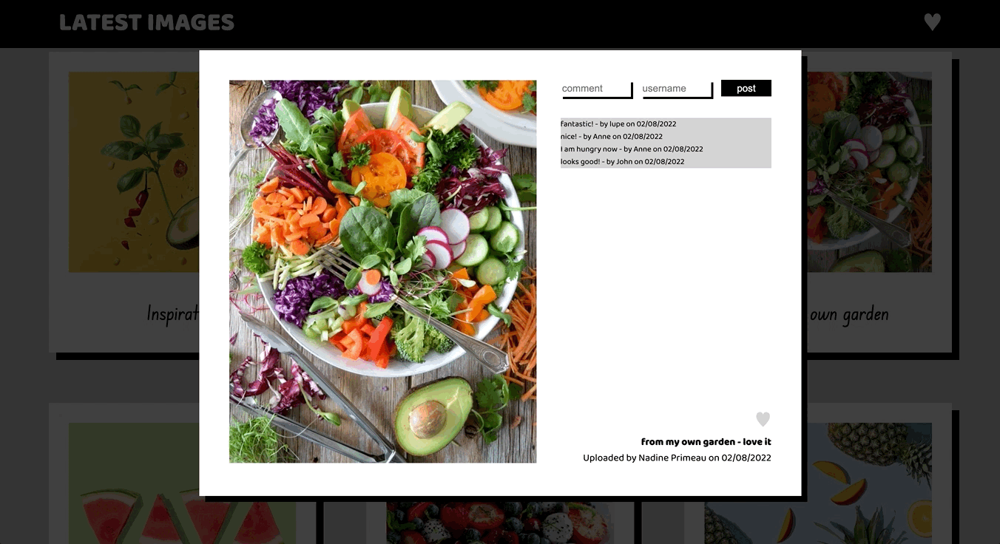

# share-it

*project done during the SPICED academy Full Stack Web Development bootcamp*  

## overview  
Share it! is a platform to upload and comment pictures in a simple way. Layout is simple but strong, with a nostalgic hint to polaroids.

- Registration and Login not necessary
- Simple picture upload with title and description
- Upload menu dissapears when scrolling to give more space for the pictures
- Pictures are loaded in groups of six for an easier experience
- Users can comment other people's pictures
- Pictures can be marked as favourite and filtered
- Website is responsive and can be used in bigger and smaller screens

## previews  

**startpage**  
upload menu that dissapears when user starts scrolling
&nbsp;

<kbd></kbd>

**image loading**  
pictures are loaded in groups of six for an easier experience
&nbsp;

<kbd></kbd>

**comments**  
real time picture comments 
&nbsp;

<kbd></kbd>

**favourites**  
pictures can be marked as favourite and filtered
&nbsp;

<kbd></kbd>
